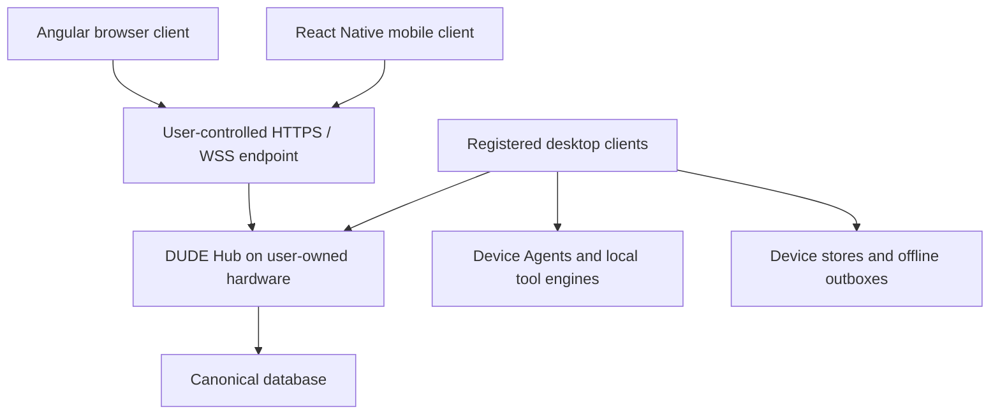

# DUDE System Architecture

The desktop is the privileged local workbench; the Hub is authoritative for synchronized shared state. Delivered paths are described separately from the target package/service architecture. Phase 31C delivered the Hub service foundation and the resident Device Agent ([as built](#as-built-in-phase-31c)) and Phase 31D delivered desktop synchronization ([as built](DATA_SYNC_ARCHITECTURE.md#as-built-in-phase-31d-synchronization)); the shared-state Hub web (31E, decisions [PD-050–PD-062](../history/DECISION_LOG.md#phase-31e-implementation-decisions)) and mobile are still planned.

Workspace implementation and host ownership are documented in [Portable Core](PORTABLE_CORE.md). The Hub service (`apps/hub`) and the Hub API client are delivered as of Phase 31C; the mobile and sync-replay reservations provide no runtime capabilities.

Read [the master PRD](../DUDE_PRD.md) first. Product direction and invariants live there; this document owns the detailed contracts in its domain.

Related: [DUDE Product Specification](../product/PRODUCT_SPEC.md) · [Data, Persistence and Synchronization](DATA_SYNC_ARCHITECTURE.md) · [DUDE Security Architecture](SECURITY_ARCHITECTURE.md) · [Quality and Release Specification](../delivery/QUALITY_AND_RELEASE.md).

## Contents

- [System Overview](#system-overview)
- [Standalone Web Delivery and Routing](#standalone-web-delivery-and-routing)
- [Tool Architecture](#tool-architecture)
- [Worker Execution Layer](#worker-execution-layer)
- [Error and Failure Isolation](#error-and-failure-isolation)
- [Dependency Philosophy](#dependency-philosophy)
- [API Integration Architecture](#api-integration-architecture)
- [Delivered Repository Architecture](#delivered-repository-architecture)
- [Suggested Tool Definition Pattern](#suggested-tool-definition-pattern)
- [Shared Services](#shared-services)
- [Performance Strategy](#performance-strategy)

## System Overview

The user-owned Hub supplies authenticated API, sync, realtime, Angular hosting and canonical persistence. Desktop Client/Agent installations keep local execution and separate Device Stores. Browser and Android clients do not acquire native desktop privileges through Hub connectivity.

[Target Architecture](#target-architecture) contains the system diagram; [DUDE Core / Shared Logic Refactor](#dude-core--shared-logic-refactor) contains the target monorepo/package layout. [Future Remote Execution](SECURITY_ARCHITECTURE.md#future-remote-execution) remains a deferred security contract rather than an ordinary Agent capability.

## Standalone Web Delivery and Routing

The web companion keeps clean, bookmarkable routes with a GitHub Pages SPA fallback. These requirements apply to the secondary web/PWA surface even though desktop is now canonical.

Requirements:

- Angular router with clean routes;
- repository-aware base path;
- deployment output suitable for GitHub Pages;
- generated/copied `404.html` fallback;
- fallback script/strategy that restores the intended SPA route;
- direct refresh on a tool URL works;
- back/forward browser navigation works;
- PWA service worker does not break route recovery;
- desktop-only tools/routes degrade to a clear explanatory capability state rather than a broken page;
- shareable web routes remain stable wherever the underlying capability is browser-safe;
- browser-to-desktop handoff through `dude://` or another explicit protocol must enhance, not replace, the corresponding web route — a browser-safe route must remain independently usable when its capability exists on the web companion.

Hash routing is explicitly not the chosen approach.

### Routing and isolation across the two web modes

| Concern | Standalone web companion | Hub-served web |
|---|---|---|
| Host | GitHub Pages static output | User-owned Hub, directly or behind an operator-controlled reverse proxy |
| Identity | No login required for local utilities | Owner-authenticated environment access |
| Shared data | No automatic canonical sync | Authenticated, scope-controlled Hub APIs |
| Route recovery | Repository base path and generated `404.html` recovery | Server SPA fallback for valid UI routes |
| API paths | No application backend assumed | API/auth/realtime paths must never be rewritten to Angular HTML |
| Native capabilities | Capability explanation or explicit desktop handoff | Same browser boundary; Hub access is not native access |
| Offline | Cached shell and available local tools | Cached tools where implemented; authenticated data has separate private-cache rules |

Hub builds must support deep links and refresh, an explicit deployment base URL, correct asset URLs and authenticated WebSocket endpoints. Static Pages deployment must not embed a private Hub URL, credentials or environment data. Connecting the standalone Pages origin directly to a Hub is not required for the initial release; using Hub-served same-origin web avoids inventing a second cross-origin credential path.

Private API/auth/sync responses and secrets must not be put into the public static-asset service-worker cache. Browser logout and environment switching must clear or lock authenticated state according to the documented session/cache policy. Local browser storage remains subject to the browser's security boundary; durable browser credential vault parity is not implied.

## Tool Architecture

The architecture should be moderately structured rather than rigidly uniform.

Tools should share a common contract where useful, while retaining freedom for different UI patterns.

### Tool metadata

Each tool should define metadata equivalent to:

```ts
// Angular composition shape: portable ToolMetadata plus application UI bindings.
// ToolMetadata itself has no load functions or component types.
interface ToolDefinition {
  id: string;
  title: string;
  shortTitle?: string;
  description: string;
  category: ToolCategory;
  keywords: string[];
  route: string;
  icon?: string;
  load: () => Promise<unknown>;
  persistence?: ToolPersistencePolicy;
  execution?: ToolExecutionPolicy;
  network?: ToolNetworkPolicy;
  status?: 'experimental' | 'stable' | 'verified';
  io: ToolIOCapabilities;
  capabilities?: readonly ToolCapability[];
  pwaShortcut?: { order: number };
  documentation?: ToolDocumentationMetadata;
}
```

This abbreviated shape reflects the shipped manifest contract. `io` is required; `capabilities` uses the closed platform/runtime vocabulary from Phase 26, replacing the former `desktopCapabilities` strings and the conceptual `platforms` field. `pwaShortcut` feeds the generated web manifest. Other fields (verification, file input, settings, consequence class, and desktop opening) live in `tool-definition.model.ts`. Each tool owns one colocated manifest; registry, routes, ToolShell, generated documentation, and discovery read that definition.

### Registry responsibilities

The registry should drive:

- sidebar navigation;
- deck discovery;
- global search;
- command palette;
- route metadata where practical;
- category grouping;
- tool status;
- persistence declarations;
- online/offline hints;
- desktop/web availability and capability indicators;
- network/external-service disclosure metadata;
- shell-visible privacy/native-capability disclosures so the shared UI does not depend on tool-local hard-coded warnings.

The shell must not contain hard-coded conditionals for individual tools.

### Tool categories

Initial category taxonomy:

- Data
- Text
- Encoding
- Security
- Date & Time
- Web
- Developer
- Documents

Avoid creating too many categories in the MVP.

Taxonomy can evolve later.

Each category is assigned one bold color from the shared palette ([Color System](../product/UX_SPEC.md#color-system)) — one per theme, contrast mode and category palette set (Vivid / Soft / Color-blind safe) since Phase 30K — used consistently for that category's sidebar group, deck section, and tool badges. Category color is metadata-driven from the registry, not hard-coded per tool.

### Platform Capability Model

Tool availability must be capability-driven.

Conceptual availability example (not the shipped manifest schema):

```ts
platforms: {
    web: true,
    desktop: true,
    mobile: true
}

capabilities: [
    "clipboard",
    "filesystem",
    "network",
    "windows-system",
    "camera",
    "share-sheet"
]
```

Possible availability:

#### All platforms

```text
JSON
Regex
JWT
UUID
Hash
Base64
Unix Time
Cron
Encoding
Text diff
```

#### Desktop + Web

```text
large structured-data tools
advanced editors
complex visualization
```

#### Desktop-only

```text
Process Viewer
Registry Editor
Services
Event Logs
Port -> Process
Windows ACLs
Dependency Walker
Local Network Inspector
```

#### Mobile-specific

```text
QR/barcode
camera
BLE
NFC
share-sheet
mobile device diagnostics
```

### One portable registry, separate UI bindings

The target capability example in [Platform Capability Model](#platform-capability-model) expresses intent; it does not reinstate a second hand-maintained `platforms` manifest or the removed `desktopCapabilities` field. Extend the shipped closed capability vocabulary through a versioned migration, adding mobile/runtime requirements where justified. Derive availability from registry metadata, runtime support, permissions and installed dependencies.

Extract portable registry metadata from Angular-specific lazy component loaders. The shared registry owns tool ID, titles, category, I/O, execution characteristics, persistence/scope declarations, consequence class, network/privacy disclosures and compatible runtime requirements. Angular and React Native each map the same stable ID to their own presentation/loader. A React Native import must not pull Angular, browser DOM, Electron or Node-only modules into a mobile bundle.

A tool being discoverable or available on a device is separate from authorization to execute a privileged action. A Hub API describing a device capability does not grant it. Unsupported tools remain searchable with accurate availability information where useful; never advertise executable mobile support solely because an engine is written in TypeScript.

## Worker Execution Layer

A reusable worker abstraction is required.

The purpose is not to move every task off the main thread.

The purpose is to make off-main-thread execution easy for tools that need it.

### Worker layer responsibilities

Where practical:

- submit task;
- receive progress/status if needed;
- receive result;
- receive typed error;
- cancel task;
- terminate/restart worker;
- avoid leaking state between unrelated jobs.

### Candidate worker-backed operations

- large JSON parsing/formatting;
- expensive regex testing;
- large diffs;
- hashing;
- large encoding/decoding;
- future compression/decompression;
- future CSV transformation.

### Scope Limit

Build one reusable abstraction and use it in enough showcase tools to prove it.

The local worker layer must not become a generalized distributed job system. Any future Hub/Agent remote-job protocol is a separate, deferred capability ([Future Remote Execution](SECURITY_ARCHITECTURE.md#future-remote-execution), Phase 88).

Do not build a worker pool unless the implementation is trivial.

## Error and Failure Isolation

Failure isolation is mandatory.

### Requirements

A tool-level error should not leave the app unusable.

At minimum:

- parsing errors stay inside the tool;
- rejected worker jobs stay inside the tool;
- failed API calls stay inside the tool;
- the sidebar remains functional;
- route navigation remains functional.

### Recovery

Tools should offer simple recovery where useful:

- clear;
- reset;
- retry;
- cancel;
- return to deck.

The original V1 did not require an elaborate crash-reporting platform, and crash reporting remains nonessential to the local utility baseline. Any later diagnostics/telemetry capability must remain opt-in, privacy-explicit, and consistent with the no-silent-transmission boundary; Phase 93 is a conditional long-horizon proposal rather than a retroactive V1 requirement.

### Distributed failure isolation

A crashed/unreachable Hub, denied session, corrupt replica, failed migration, full disk or incompatible protocol must not freeze the local shell. Show actionable local error state and preserve recoverable data. Realtime reconnection must be bounded; local tool use must not wait for network startup.

Hub lifecycle is independent of Electron UI lifecycle. Client logout, renderer crash, desktop window close and ordinary client updates must not implicitly stop a shared Hub. Deliberately stopping/uninstalling the Hub requires a separate operator action that explains impact on other devices.

## Dependency Philosophy

The project is library-forward.

Use mature third-party libraries where they materially reduce implementation effort or increase correctness.

Examples of acceptable library use:

- Markdown parsing/rendering;
- diffing;
- regex utilities;
- JWT parsing;
- syntax highlighting;
- formatting/parsing;
- UUID generation;
- hashing where browser-native APIs are insufficient;
- PWA helpers already natural to Angular.

### Dependency rule

A dependency is acceptable when:

- it solves a real problem;
- it runs on every platform where the capability is declared available, with browser-compatible dependencies required for web-companion/shared-core paths;
- it does not introduce a mandatory remote server or hosted-cloud dependency for functionality that can reasonably remain local; local bundled services, user-controlled self-hosted services, and capability-specific native dependencies are allowed where the roadmap explicitly calls for them;
- it is reasonably maintained;
- it does not introduce a fundamentally conflicting architecture.

**Historical V1 rule preserved:** when DUDE was browser-first, this was expressed more narrowly as “it works in the browser” and “it does not require a server.” The desktop-first product keeps the intent—portable, local-first dependencies—while allowing native and local-service dependencies for capabilities the browser cannot provide.

### Not a Priority

Do not spend time rewriting mature libraries to reduce dependency count.

## API Integration Architecture

Network integrations are allowed when they are integral to a tool or workflow, but local execution remains the default whenever practical.

User-supplied API keys are the default credential model for external services. Desktop DUDE may also use OS-level secure storage, local provider configuration, or self-hosted/on-prem credentials where appropriate.

### Rules

- No static private secrets in source control or compiled distributions.
- No DUDE-operated cloud proxy is part of the current architecture/product direction.
- A **local bundled proxy/backend** is allowed and already shipped where browser restrictions or credential isolation make it necessary (for example Phase 8 Stage 4's LLM proxy, which Phase 31B replaced with a sender-checked main-process IPC call).
- User-owned/self-hosted relays, servers, and remote runners are allowed when the user explicitly configures them.
- Network activity, persistence behavior, platform/native capabilities, and external-data boundaries must be represented in canonical tool/capability metadata and remain consumable by shell-level disclosure UI rather than being buried only inside individual tool implementations.

Each API-backed tool should declare:

- external service name;
- whether network is required;
- whether an API key/credential is required;
- how the credential is stored;
- what user input is transmitted;
- whether data leaves the machine directly, through a local proxy, or through explicitly configured user-owned infrastructure;
- what happens offline;
- desktop/web availability;
- any destructive or privileged actions exposed by the integration.

## Delivered Repository Architecture

Exact naming may evolve, but keep the separation of responsibilities and the **shared-core rule**. The repository should not fork into unrelated web and desktop implementations.

The implementation uses npm workspaces with the current Node/npm pins, one root lockfile and root-controlled release versioning. See [Portable Core](PORTABLE_CORE.md) for the ownership and acceptance contract.

```text
apps/web/                Angular renderer, assets, UI bindings and browser adapters
apps/desktop/            Electron composition and native adapters
apps/device-agent/      Resident per-user Device Agent process (node:sqlite Device State Store, Hub client); never executes tools
apps/collab-relay/       Existing standalone relay
apps/hub/                Self-hosted DUDE Hub service (Fastify, node:sqlite, Node SEA); delivered in 31C
apps/mobile/             Documented future placeholder
packages/shared-types/  Closed vocabularies
packages/domain/        Workbench entities, metadata and scope
packages/contracts/     Execution, worker and native/host ports
packages/validation/    Portable validation
packages/crypto/        Crypto and host installation
packages/tool-engine/   Transforms, composition, tests and fixtures
packages/tool-registry/  Authoritative manifests and generated metadata
packages/persistence/    Device/environment records, UUIDv7, scoped settings, entity codecs, repository ports and contract suites, secret references
packages/sync/           Outbox op model, sync categories/policies, merge, limits (31D)
packages/api-client/     Portable typed Hub client over an injected transport port (31C)
packages/sqlite-store/   Node-only node:sqlite plumbing shared by the Hub and the Device Agent (31C)
packages/agent-pipe/     Node-only authenticated named-pipe protocol between the desktop and the Agent (31C)
packages/collab-protocol/ Existing Node-only Yjs rooms (not portable core)
infrastructure/          Documented deployment/database/networking/packaging reservations
```


The original V1 architectural shape — `core/`, `shell/`, `shared/`, and `tools/` under Angular — remains valid and is preserved by this expansion. Not every tool needs every file. Avoid ceremony for small utilities.

#### Distributed manifests and metadata ownership

Phase 22 retired the multi-thousand-line monolithic `TOOL_DEFINITIONS` maintenance pattern in favor of tool-local or category-local manifests composed at build time. A tool owns its metadata beside its implementation. The registry remains the runtime authority, but it is assembled rather than hand-edited as one giant file.

#### Platform adapters

Phase 8 already proved the platform-adapter direction. Browser APIs and Electron/native APIs should implement narrow interfaces behind `PlatformService`/native bridges rather than causing duplicated tool implementations.

The renderer keeps `contextIsolation`; no direct Node access is introduced for convenience. Native behavior goes through preload/IPC or other explicitly reviewed adapters.

#### Shared logic

`apps/web/src/shared-logic/` was established in Phase 8 Stage 5 when Base64/hash logic needed reuse by Electron shell actions. Phase 22 broadens that precedent: if logic can reasonably be framework-neutral, it should be extractable and testable outside Angular so CLI, IDE extensions, browser extensions, SDKs, workers, Electron, and tests can reuse the same implementation.

### Target Architecture



The Hub contains Angular web hosting, API, authentication, synchronization, device registry, WebSocket/realtime, collaboration, backup coordination, and future job coordination. Desktop A, Desktop B, and Laptop C each contain a Client, Agent, Tool Engine, and Device Store. Browser and mobile are additional clients, not additional authoritative backends.

A Hub machine may simultaneously be a normal desktop client and agent:

| Main Desktop component | Role |
|---|---|
| DUDE Desktop Client | Interactive Angular/Electron UI |
| DUDE Device Agent | Privileged local execution |
| DUDE Device State Store | Cache, device/private state and offline outbox |
| DUDE Hub Service | Web, API, Auth, Sync, Realtime, Device Registry and Canonical DB |

### DUDE Hub Architecture

The Hub is the user-owned control plane. It does not introduce a vendor-hosted "DUDE Cloud."

#### Hub responsibilities

| Hub subsystem | Responsibility |
|---|---|
| Angular Web Host | Browser application delivery |
| API Service | Authenticated application operations |
| Authentication | Owner identity and sessions |
| Device Registry | Registration, identity, capabilities and revocation |
| Sync Service | Canonical revisions and change exchange |
| Realtime/WebSocket Service | Authenticated notifications and updates |
| Collaboration Service | Explicit shared sessions/documents |
| Canonical Repository | Durable shared state |
| Backup Service | Export, restore and transfer |
| Audit/Security Events | Security-relevant records |
| Future Remote Job Coordinator | Deferred capability-scoped device jobs |

#### Hub should be independent of the Electron window

If the Hub runs on a Windows desktop, it should ideally operate as a background service.

Example:

DUDE Hub Service starts automatically and runs whether or not the Electron UI is open.

Closing the DUDE desktop UI should not shut down:

- synchronization;
- web access;
- mobile access;
- other registered devices.

#### Hub installation modes

DUDE should support at least:

```text
Install DUDE
[ ] Desktop Client
[ ] Device Agent
[ ] DUDE Hub
```

Typical main-machine install:

```text
[x] Desktop Client
[x] Device Agent
[x] DUDE Hub
```

Typical secondary machine:

```text
[x] Desktop Client
[x] Device Agent
[ ] DUDE Hub
```

### Desktop Application Architecture

The installed desktop application should evolve toward:

| Desktop component | Contents / responsibility |
|---|---|
| Angular Renderer | Tool and workbench UI |
| Electron Shell | Installed application shell |
| Preload / IPC Boundary | Validated capability access |
| DUDE Device Agent | Filesystem, process/system, network, database, container, Git, SSH and local AI services |
| Shared DUDE Core | Framework-neutral tool/domain logic |
| Device SQLite Store | Local persistence and replicas (delivered in 31B and now owned by the resident Device Agent, see [As built in Phase 31C](#as-built-in-phase-31c)) |
| Sync Client | Hub change exchange and offline replay |
| Encrypted Credential Vault | Local secret references |
| Native Windows Helpers | OS-specific capability implementations |

#### Device State Store service vs Device Agent

Two different things have been called an "agent"; this document keeps them apart.

| | Resident Device Agent (delivered, Phases 31B-31C) | Privileged Device Runtime (planned boundary) |
|---|---|---|
| Purpose | Owns the local SQLite database | Privileged local execution: filesystem, process/system, network, database, container, Git, SSH and local AI services |
| Process | Separate per-user Node process from `apps/device-agent` (`dude-agent.exe` SEA; Electron-as-Node in development) that outlives the desktop window | Not yet a separate process; today's native capabilities are Electron-main bridges and native helpers |
| Privilege | Per-user and unelevated: no tool execution, no shell; typed RPC only. It reaches the configured Hub (and only the Hub) over pinned TLS and holds the DPAPI-wrapped device key | Privileged, with explicit validated, authorized operations |
| Callers | Electron main only, over an authenticated per-user named pipe (the renderer never holds a handle) | Local application today; strongly authorized remote jobs only in a later phase |
| Lifecycle | Resident: started at sign-in and ensured by the desktop; main reconnects with backoff and shows a degraded banner when unreachable; quit detaches rather than stops | Not decided |

**Delivered in Phase 31C.** [PD-026](../history/DECISION_LOG.md#phase-31c-implementation-decisions) (as amended) replaced the Electron-forked `utilityProcess` and `MessagePort` supervision with the resident per-user Agent described in [As built in Phase 31C](#as-built-in-phase-31c). The Agent still never executes tools and grants no remote execution; the privileged Device Runtime column remains a planned boundary, and the Agent is not that boundary until it gains those capabilities.

The directory name `apps/device-agent` is historical from planning. User-facing text calls the process the *background agent* (Settings > This Device); architecture text calls it the *Device Agent* or, where the distinction matters, distinguishes it from the planned privileged runtime.

**Renderer origin.** The packaged renderer loads from the privileged custom scheme `dude-app://app/` served in-process by main, a fixed origin that keeps localStorage/IndexedDB across launches (the earlier loopback server's per-launch port did not). The web companion keeps its `https://` origin and `/DUDE/` base path. Both builds run the same Angular code; desktop reads a store snapshot before bootstrap, and the web build reads browser storage through the same repository ports.

| Desktop runtime piece | Role |
|---|---|
| Renderer (`dude-app://app/`) | Angular UI, synchronous signals over an in-memory cache |
| Electron main | Window, protocol handler, sender-checked IPC, store broker, secrets, LLM bridge, native bridges |
| Device Agent (separate per-user process, over the named pipe) | SQLite Device State Store, Hub enrollment and connection |
| File-walk/fs utility process, native helpers | Existing streamed filesystem and Windows helpers |

The renderer should remain sandboxed.

Native capabilities should remain behind:

- explicit IPC contracts;
- validation;
- allowlists;
- confirmation boundaries;
- least-privilege behavior.

### As built in Phase 31C

Phase 31C (Milestones 628-648) delivered a self-hosted Hub foundation and the resident Device Agent. Decisions are [PD-023 to PD-037](../history/DECISION_LOG.md#phase-31c-implementation-decisions); the amendments to PD-025 and PD-026 are recorded there. Phase 31D (Milestones 649-662) added synchronization: `@dude/sync` holds the categories, policies, merge and limits; the Hub exposes revision-checked `/api/v1/sync` routes and a compaction timer over migration 0003; the Device Agent runs the sync engine (outbox replay, cursors, conflict inbox, quarantine, first-sync preview) and relays `sync.status` and `sync.applied` frames to the desktop's sender-checked `dude:sync:*` bridge, which feeds live apply and the shell sync indicator in the renderer. Decisions are [PD-038 to PD-049](../history/DECISION_LOG.md#phase-31d-implementation-decisions) and the contract is [As built in Phase 31D](DATA_SYNC_ARCHITECTURE.md#as-built-in-phase-31d-synchronization). The shared-state Hub web, trusted certificates and Internet/public mode, and backup are not delivered (31E-31G).

**Hub process.** `apps/hub` is plain TypeScript compiled by esbuild to a CJS bundle and packaged as a Node 24 single-executable application (`dude-hub.exe`, `postject`, unsigned) with a startup self-test of `node:sqlite`, Argon2id, Ed25519 and P-256. It runs as a Windows service (WinSW 2.12.0 under the virtual account `NT SERVICE\DudeHub`), a non-root Docker image, or a foreground `dude-hub run --data-dir <dir>`. Fastify serves HTTPS only (self-signed ECDSA P-256, loopback `127.0.0.1:47600` by default; `0.0.0.0` only in LAN or container mode) with REST under `/api/v1`, static hosting of the Hub web build with SPA fallback that never rewrites `/api/*`, and an authenticated WebSocket at `/api/v1/realtime`. Modules under `apps/hub/src/`:

| Module | Responsibility |
|---|---|
| `server/` | Fastify app, routes (hello, bootstrap, auth, sessions, devices, device auth and recovery, TLS and audit), static hosting, error mapping |
| `security/` | Headers and CSP, Host allowlist, Origin/Fetch-Metadata/CSRF by credential type, rate limits, persisted throttle, audit log, ConfirmationStore |
| `auth/` | Owner password and recovery codes, setup token, cookie and bearer sessions, device-token resolution |
| `devices/` | Pairing codes, Ed25519 keys, device tokens, the registry |
| `realtime/`, `tls/` | WebSocket protocol and presence; certificate generation, SPKI pins and dual-pin rotation |
| `db/` | Canonical SQLite open/migrations and the atomic commit repository |
| `admin/` | Local admin named pipe or Unix socket so CLI commands never open `dude.db` while the service runs |
| `service/`, `cli/` | Windows service wrapper, LAN toggle and firewall rule, doctor, purge; the hand-parsed `dude-hub` CLI |

The Hub is the only writer of `data/dude.db`. Its data directory is `%ProgramData%\DUDE\Hub` (`service/`, `data/`, `storage/`, `backups/`, `config/`, with pre-migration copies in `data/pre-migration/`); `backups/` stays unused until Phase 31G.

**Packaging and install.** `DUDE-Hub-Setup.exe` is its own elevated makensis installer with its own Apps & Features entry, installing to Program Files. The desktop installer embeds it behind an interactive, default-off page and never touches the Hub on update or uninstall. Hub updates are an explicit user action: the desktop's Update Hub elevates the bundled `DUDE-Hub-Setup.exe` in `/UPDATE` mode (stop, replace, start; data migrates when the service starts), offered only from a per-machine (Program Files) desktop install because a per-user install's resources are user-writable. See [Windows setup](../WINDOWS_SETUP.md#the-dude-hub-optional). Build scripts: `hub:compile`, `hub:sea`, `hub:stage`, `hub:installer`.

**Resident Device Agent.** `apps/device-agent` is a separate per-user Node process (`dude-agent.exe` SEA; Electron-as-Node in development). The desktop reaches it over `@dude/agent-pipe`: a per-user named pipe (Unix socket on Linux CI) whose name is derived from a hash of the store directory (per-user by location), length-prefixed JSON with base64 bytes, and a server-first handshake in which the Agent proves knowledge of a per-profile key before the desktop sends anything. The Agent reads the machine fingerprint itself and reopens the store from its last desktop-supplied config, so it runs with no desktop. The desktop spawns it detached; a packaged build with the default "start at sign-in" only checkpoints and detaches on quit. The sign-in start is a per-user `ONLOGON` scheduled task, falling back to the `HKCU` Run key because standard users are denied that task. A version handshake restarts an Agent that differs from the desktop. Settings > This Device shows a Background agent row (state, start at sign-in, stop/start). Store quarantine moved into the Agent because Windows cannot rename files it holds open. It holds the Ed25519 device key wrapped with CurrentUser DPAPI through the `windows-sys` helper, enrolls from a `dude-pair` string, keeps an authenticated realtime connection with heartbeats and backoff, follows staged TLS pins, detects revocation, incompatibility and untrusted TLS, and holds the owner bearer session in memory only. AI secrets stay with Electron main `safeStorage`. The Agent never executes tools; PD-010 holds.

**Desktop Hub bridge.** The renderer reaches `hub.*` Agent RPC only through sender-checked, strictly validated `dude:hub:*` IPC in Electron main (`window.dude.hub`), which scrubs credential-like fields from results and pushes status changes. Admin operations that need elevation (local Hub setup hand-off, Update Hub) use a UAC-elevated command with arguments passed through the environment, never the script text.

**Hub web host mode.** `HostKind` is `desktop | web-standalone | hub-web`. `hub-web` is chosen at build time by the `production,hub` Angular configuration (`npm run build:hub-web`: base href `/`, no service worker, output `dist/hub-web`); the Pages and desktop bundles do not include the API client. Settings sections declare the hosts they support instead of a desktop-only flag; Environment & Hub, Devices and Security & Sessions are available on `desktop` and `hub-web`. The `HUB_ADMIN` port has desktop (IPC), hub-web (same-origin fetch with an in-memory CSRF token) and unavailable adapters. `/hub/setup`, `/hub/sign-in` and `/hub/recover` match only on `hub-web`, behind a session guard (shell exception #12). The Hub hashes the `index.html` inline scripts into `script-src`; it never allows `'unsafe-inline'` for scripts. Tools in the Hub web run locally in the browser as on the Pages companion.

**Contract source.** Hub request/response schemas are TypeBox schemas under `@dude/contracts/hub` (a subpath, not re-exported from the package index). `@dude/api-client` is a portable typed client over an injected transport port that validates responses with the same schemas, and `apps/hub/src/server/api-client-parity.spec.ts` fails when a Hub route has no client method or vice versa. Protocol compatibility uses an integer `protocolVersion` and `minClientProtocol` negotiated in the REST and WebSocket hellos (PD-037).

**Not yet at 31C close.** No sync service, record endpoints, collaboration, backup, Hub-served shared state, trusted-CA or public exposure, and no remote execution. Phase 31D since added synchronization and record endpoints for desktops; Phase 31E plans the shared-state Hub web, trusted certificates and the exposure model.

### DUDE Core / Shared Logic Refactor

The highest-return prerequisite remains extracting framework-independent logic.

Current concepts such as:

```text
apps/web/src/app/tools
apps/web/src/app/core
apps/web/src/app/shared
apps/web/src/shared-logic
```

should evolve toward reusable packages.

Suggested structure:

| Path | Purpose |
|---|---|
| `apps/web/` | Angular browser application |
| `apps/desktop/` | Electron desktop composition |
| `apps/mobile/` | React Native application |
| `apps/hub/` | Authoritative self-hosted service |
| `packages/domain/` | Domain models |
| `packages/tool-engine/` | Framework-neutral tool engines |
| `packages/tool-registry/` | Portable metadata |
| `packages/contracts/` | API and protocol contracts |
| `packages/validation/` | Shared validation |
| `packages/crypto/` | Runtime-compatible cryptographic interfaces/helpers |
| `packages/sync/` | Sync models and client logic |
| `packages/api-client/` | Typed Hub client |
| `packages/shared-types/` | Shared foundational types |
| `native/windows-sys/` | Native Windows helper |
| `infrastructure/packaging/` | Installer/service/mobile packaging |
| `infrastructure/networking/` | Exposure and endpoint configuration |
| `infrastructure/database/` | Database infrastructure and migration tooling |
| `infrastructure/deployment/` | Deployment support |
| `tests/` | Cross-package and integration verification |

npm or pnpm workspaces are appropriate.

The governing rule remains:

> **A tool's transformation logic must not know Angular exists.**

Instead of:

```ts
@Component(...)
export class JsonFormatterComponent {
    formatJson() {
        ...
    }
}
```

prefer:

```ts
export function formatJson(
    input: string,
    options: JsonOptions
): JsonResult
```

Then reuse from:

```text
Angular Desktop
Angular Web
React Native
Node/CLI
Tests
Future integrations
```

### Service and adapter boundaries

Use a single maintainable Hub application with clear internal modules initially; the list of Hub services is a responsibility decomposition, not a requirement to deploy independent microservices. The Hub framework/runtime and packaging are delivered in 31C: Fastify with REST `/api/v1` ([PD-023](../history/DECISION_LOG.md#phase-31c-implementation-decisions)), a Node single-executable application with a Windows service, Docker and foreground modes ([PD-024](../history/DECISION_LOG.md#phase-31c-implementation-decisions)).

Hub modules access canonical state through repository interfaces; clients never mount/open the Hub database. Device repositories manage local persistence; platform adapters own OS/browser/mobile-specific facilities. The local Device Agent starts as the formal boundary around existing Electron/native services; a separately resident Agent process is not automatically required merely because the Hub must be a background service. The Agent process/lifecycle model is delivered in 31C ([PD-026](../history/DECISION_LOG.md#phase-31c-implementation-decisions)): a resident per-user process, preserving local IPC validation and confirmation semantics.

Keep co-located Hub and Agent responsibilities distinct. A Hub service account must not inherit unrestricted native desktop control; local user-vault access, elevated actions and interactive confirmations belong to their explicit device/runtime boundaries. Future remote jobs require a separate reviewed protocol.

Migrate packages incrementally, maintaining buildable desktop and standalone web artifacts at every stage. Keep stable tool IDs/routes, manifests, adapters, native helpers and published vectors. Do not combine package extraction with gratuitous tool rewrites. Reuse shipped collaboration engine code behind an adapter when appropriate; do not claim its existing ephemeral room model already supplies authenticated durable Hub collaboration.

## Suggested Tool Definition Pattern

A tool owns canonical metadata in `packages/tool-registry/src/tools/<id>/<id>.manifest.ts`, portable engines in their package owner, and literal lazy bindings beside the Angular component. Generation joins these owners without manual core/shell registration.

Conceptual example:

```ts
export const manifest: ToolMetadata = {
  id: 'json',
  title: 'JSON Formatter',
  description: 'Validate, format, and minify JSON.',
  category: 'data',
  keywords: ['json', 'format', 'validate', 'pretty', 'minify'],
  route: '/tools/json',
  persistence: {
    input: 'none',
    preferences: 'local'
  },
  execution: {
    worker: 'optional'
  },
  network: {
    required: false
  },
  io: {
    accepts: ['text', 'json'],
    produces: ['text', 'json', 'file']
  },
  capabilities: [], // No native/optional-runtime requirement for this example.
  status: 'stable'
};
```

The shell, routes, ToolShell, search, command palette, platform-capability indicators, generated documentation, pipeline/workspace adapters, privacy/network disclosures, and confidence badges should consume this canonical metadata rather than importing tool-specific behavior or repeating titles/status fields at call sites.

Phase 22 adds structural validation and distributed manifests. Phase 23 expands the status model from the historical `stable | experimental` distinction to include a carefully-defined `verified` tier without implying external certification.

### Shared Contracts

Common TypeScript contracts should include:

```text
Workspace
Project
Pipeline
ToolDefinition
ToolCapability
UserSettings
SettingDefinition
Device
DeviceCapability
SyncOperation
SyncConflict
HistoryEntry
ConnectionDefinition
```

The shared contracts package should be consumed by:

- Hub;
- desktop client;
- device agent;
- web client;
- mobile client;
- tests.

### Contract versioning and compatibility

Version shared entity schemas, sync envelopes and API/protocol compatibility. The Hub, desktop, mobile and web may update at different times. Define a supported version window and migration policy before the first distributed release; incompatible clients receive an actionable upgrade/recovery state without corrupting records or losing outboxes.

Published shared contracts describe data, not broad native function handles. Native IPC contracts, Hub APIs and future remote-job messages have separate validators and authorization boundaries even if they reuse common types. Generate/document types from a canonical contract source rather than duplicating wire models per client.

## Shared Services

### Tool Registry Service

Responsibilities:

- expose tool definitions;
- category grouping;
- keyword search;
- route lookup;
- stable IDs;
- duplicate validation in development.

### Persistence Service

Responsibilities:

- namespace data by tool;
- support session/local/nonpersistent policy;
- explicit handling of sensitive values;
- serialize preferences;
- clear tool state;
- clear all local DUDE state with explicit scope; a local reset must not imply deleting canonical Hub state or all registered-device state.

As built in Phase 31B, `PersistenceService` keeps its synchronous signals but resolves each key's data scope on write and, on desktop, persists through the device key/value backend into the Device State Store (web: browser storage). Entity collections (favorites, pipelines, user scripts, projects, workspace templates) are reached through an `ENTITY_STORE` repository abstraction with optimistic update and rollback. See [Data and synchronization](DATA_SYNC_ARCHITECTURE.md#device-state-store).

### Worker Service

Responsibilities:

- start work;
- cancel work;
- normalize error handling;
- terminate failed jobs;
- expose busy state.

### Connectivity Service

Responsibilities:

- current online/offline signal;
- in the target, distinguish Internet connectivity, Hub reachability, authenticated session state, sync progress and local/native capability availability;
- tool-level network status;
- compact offline UI support.

### Search Service

Responsibilities:

- title matching;
- keyword matching;
- category matching;
- ranking exact/prefix matches ahead of loose matches.

Do not overbuild search.

A straightforward in-memory search is sufficient.

### Platform Service

Added in [Phase 8](../history/DELIVERY_HISTORY.md#phase-8) Stage 1 as the seam every desktop-only stage conditions on. Responsibilities:

- detect the Electron desktop shell via the flag `apps/desktop/preload.ts` injects through `contextBridge` — never `navigator.userAgent` sniffing;
- expose the result as a readonly `isDesktop` signal, same shape as the Connectivity Service's `online` signal;
- stay tool-agnostic — a boolean primitive the shell or any tool can read, never a place for desktop-feature logic itself.

**✅ Extended in Phase 25** (Milestone 448, crash/restart recovery): gained a second static, preload-computed flag, `wasRestoredAfterCrash` — true only for the one launch immediately following an unclean exit — read once at construction the same way `isDesktop` already is.

### Metadata / Manifest Validation

Phase 22 adds build/CI validation for unique IDs/routes, valid categories, I/O declarations, persistence compatibility, pipeline/workspace adapters, lazy-loader existence, confidence/status values, platform availability, capability declarations, and documentation metadata.

**✅ Updated in Phase 26 (Milestone 482):** the conformance harness validates the closed `capabilities` platform/runtime vocabulary against actual native-service imports and runtime references. `desktopCapabilities` was removed.

### Capability / Permission Service

**✅ Platform capability catalog shipped (Milestone 482):** tool manifests declare native features and optional runtimes through a closed vocabulary; registry helpers, generated docs, badges, offline readiness, and pipeline gating consume it. This describes availability, not permission to execute an action. A broader permission service for future native, remote, plugin, and automation operations remains roadmap work; user intent and destructive-action confirmation still gate execution.

### Local Usage / Recents Service

**✅ Shipped in Phase 24** (Milestones 407–419): `core/usage/UsageService` (frequency + recents), `core/favorites/FavoritesService` (tools + pipelines), `core/suggestions/` (related-tool + pipeline suggestions), and `core/recents/UnifiedRecentsService` (a derived, read-only merge — never a fifth recording mechanism). All private-by-construction: no analytics, no remote telemetry, mechanically audited in Milestone 420.

### Desktop Native-Service Boundary

Electron preload/main-process services expose narrowly-scoped native primitives. Tool code should not gain broad Node/native access simply because it runs in the desktop product. The permission/capability surface should remain inspectable and testable.

**Upheld through Phase 25**: every new preload/IPC surface that phase added (deep-link forwarding, the registry-driven native-menu snapshot, Quick Launcher hotkey/geometry control, the `dude:open:reopen`/`dude:open:enqueuePath` handlers, the crash-detection flag) stays a narrowly-scoped primitive validated on the main-process side, never a broad capability handed to the renderer wholesale.

### New shared service responsibilities — planned

| Service boundary | Responsibilities |
|---|---|
| Scoped settings/repositories | Scope and sensitivity enforcement, versioned storage, explicit per-device bindings |
| Environment/identity client | Hub endpoint, enrollment, authenticated sessions, recovery/revocation state |
| Sync client | Durable outbox, cursor catch-up, idempotent retries, conflicts and privacy filters |
| Hub canonical repository | Sole normal writer, transactions, migrations, change feed and backup consistency |
| Hub device registry | Device identity, capabilities, last-seen state and revocation |
| Realtime transport | Authenticated notifications/presence; no substitution for durable sync |
| Backup/transfer service | Encrypted export/restore, integrity, compatibility and single-authority transfer |
| Mobile platform adapters | Secure credentials, local store, file/clipboard/share/camera and optional radio capabilities |

These services extend the shipped abstractions; none implies generic public RPC into Electron or automatically synchronizing existing local recents/history.

## Performance Strategy

Performance work should remain pragmatic, but desktop scale, hundreds of tools, large runtimes, and PWA cache growth now justify explicit budgets.

### Required

- route-level lazy loading;
- reusable worker abstraction;
- avoid loading heavy tool libraries before the tool is visited;
- avoid re-rendering the entire shell during tool-local state changes where practical;
- keep navigation responsive;
- measure cold/warm desktop startup where native services are involved;
- stream or lazily inspect large files/directories where practical instead of eagerly buffering by default;
- keep optional runtimes (WASM, Pyodide, local models, language services, etc.) out of the critical startup path;
- map built tool chunks and runtimes to offline readiness, and let users pre-cache them with a size preview.
